# 🚀 ArgoCD Setup and Usage Guide

Transform your Kubernetes deployments with GitOps automation using ArgoCD - the industry-leading continuous delivery platform that ensures your applications always match their desired state.

---

## 📚 Table of Contents

- [📖 Overview](#-overview)
- [⚙️ Prerequisites](#️-prerequisites)
- [🔧 Installation](#-installation)
- [🌐 Accessing ArgoCD UI](#-accessing-argocd-ui)
- [📦 Creating Applications](#-creating-applications)
- [📁 Managing Applications](#-managing-applications)
- [🔗 Connecting Git Repositories](#-connecting-git-repositories)
- [🛠️ Troubleshooting](#️-troubleshooting)

---

## 📖 Overview

**ArgoCD** revolutionizes application deployment through declarative GitOps principles. This powerful continuous delivery tool automatically synchronizes your Kubernetes applications with Git repositories, ensuring perfect alignment between your desired configuration and running state. Experience seamless deployments, automatic drift detection, and complete deployment visibility.

**Key Benefits:**
- **GitOps Workflow**: Your Git repository becomes the single source of truth
- **Automatic Synchronization**: Continuous monitoring and deployment updates
- **Visual Management**: Rich web UI for application lifecycle management
- **Multi-Environment Support**: Deploy across development, staging, and production seamlessly

---

## ⚙️ Prerequisites

Before diving into ArgoCD, ensure you have these essentials ready:

- **Kubernetes Cluster**: Local environment (Minikube, Kind) or cloud-based (EKS, GKE, AKS)
- **kubectl Access**: Properly configured cluster connectivity
- **Git Repository**: Contains your Kubernetes manifest files
- **Basic Kubernetes Knowledge**: Understanding of pods, services, and deployments

---

## 🔧 Installation

### Step 1: Create ArgoCD Namespace

Establish a dedicated namespace for ArgoCD components:

```bash
kubectl create namespace argocd
```

### Step 2: Deploy ArgoCD Components

Install the complete ArgoCD stack with a single command:

```bash
kubectl apply -n argocd -f https://raw.githubusercontent.com/argoproj/argo-cd/stable/manifests/install.yaml
```

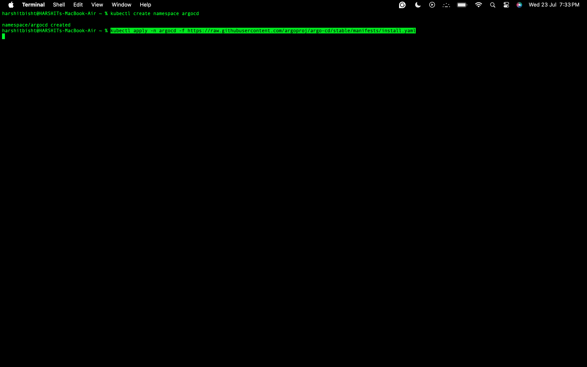

Witness the comprehensive installation of all ArgoCD components:

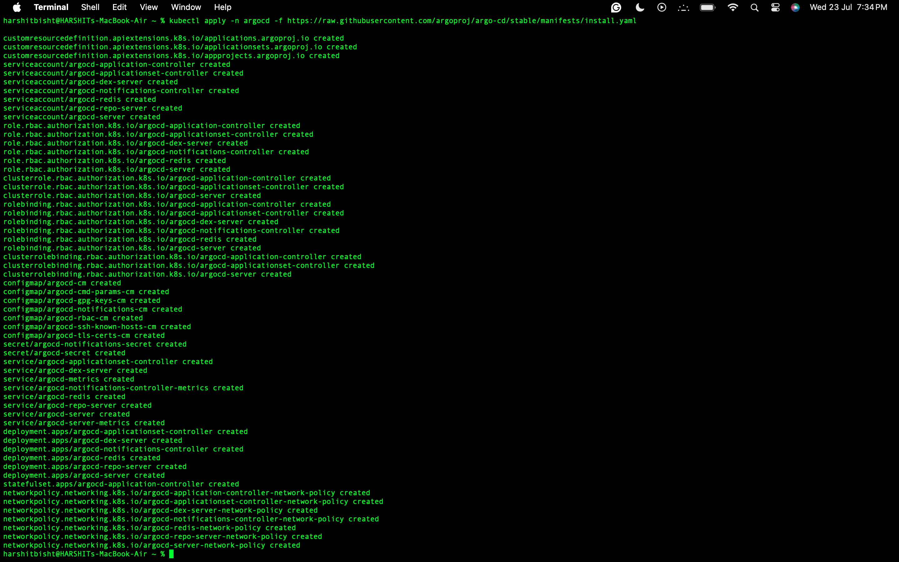

### Step 3: Verify Successful Installation

Confirm all ArgoCD pods are running correctly:

```bash
kubectl get pods -n argocd
```

Monitor the pod status to ensure complete deployment:

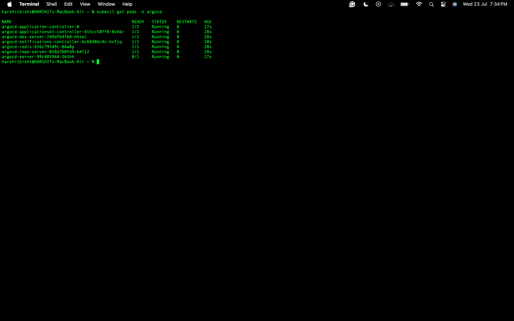

Inspect the available services:

```bash
kubectl get svc -n argocd
```

---

## 🌐 Accessing ArgoCD UI

Unlock the powerful ArgoCD dashboard with these simple steps:

### Step 4: Configure External Access

Transform the ArgoCD server service to NodePort for local access:

```bash
kubectl patch svc argocd-server -n argocd -p '{"spec":{"type":"NodePort"}}'
```

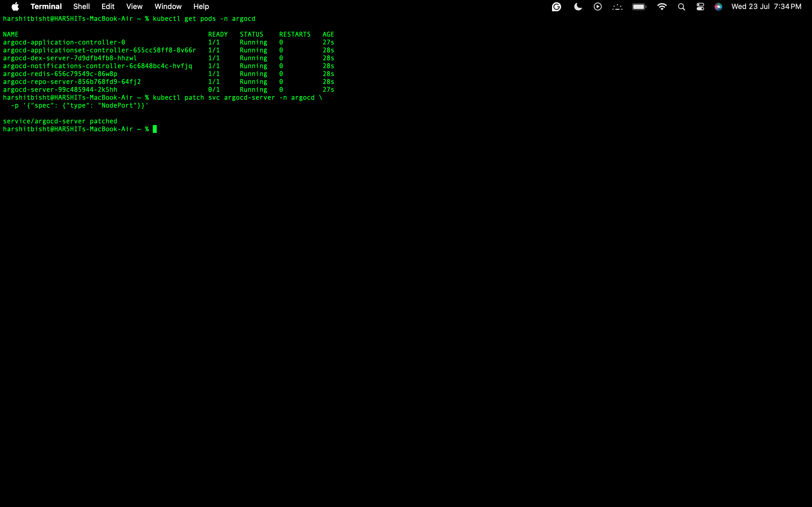

### Step 5: Locate Access Endpoint

Discover your ArgoCD service endpoints:

```bash
kubectl get svc -n argocd
```

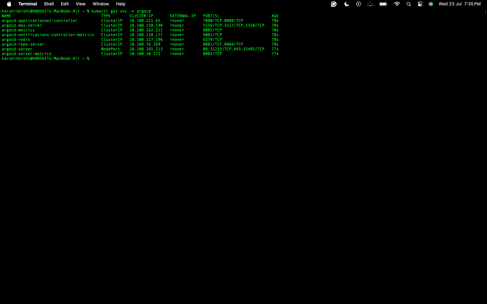

Access the UI through your browser using `NodeIP:NodePort`.

### Step 6: Retrieve Admin Credentials

**Default Authentication:**
- **Username:** `admin`
- **Password:** Execute this command to reveal the admin password:

```bash
kubectl -n argocd get secret argocd-initial-admin-secret -o jsonpath="{.data.password}" | base64 -d && echo
```

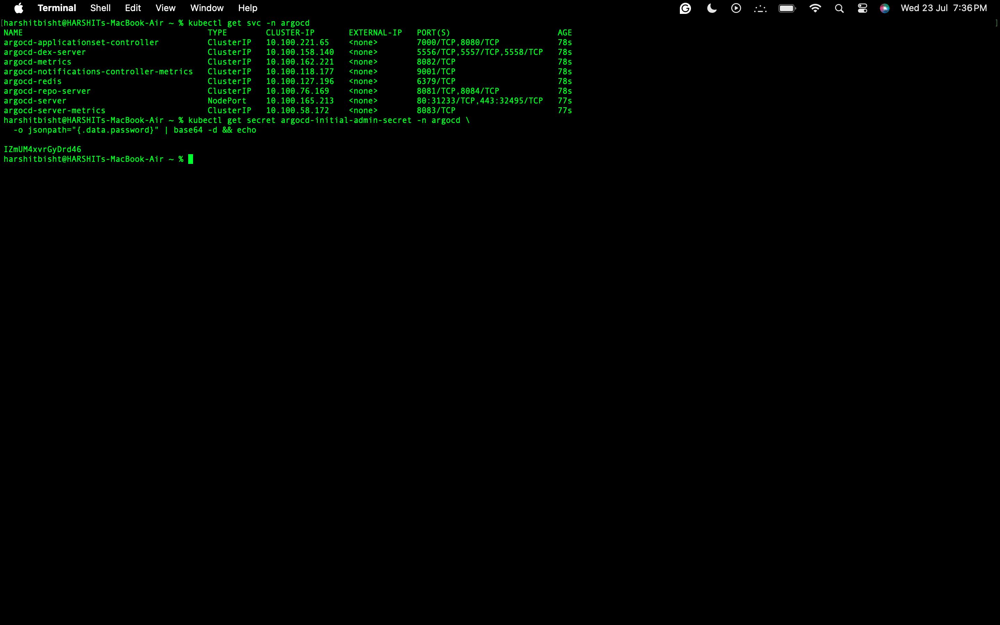

### Step 7: Complete Login Process

Enter your credentials to access the dashboard:

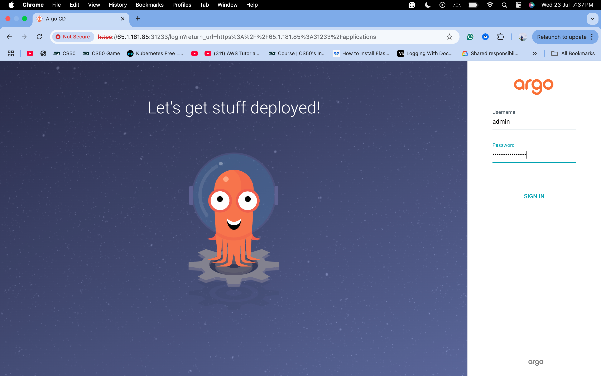

Navigate through any security warnings to reach the main interface:


**Welcome to ArgoCD!** You've successfully accessed the command center for your GitOps operations.

---

## 📦 Creating Applications

### Method 1: UI-Based Application Creation

Experience the intuitive application creation process through ArgoCD's web interface.

#### Step 1: Initiate New Application

Click the **"+ NEW APP"** button to begin:

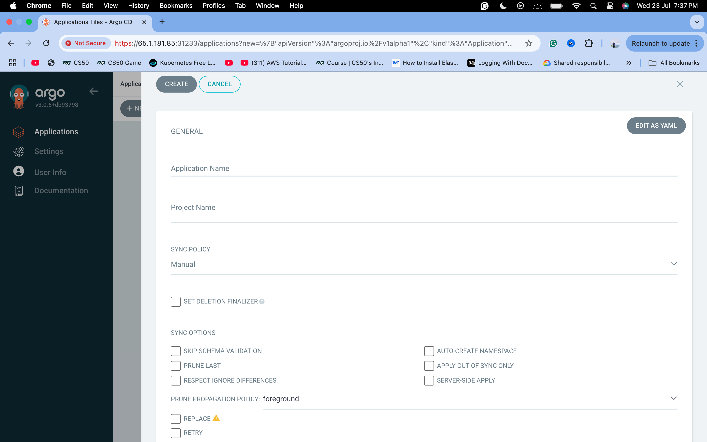

#### Step 2: Configure Application Details

**Application Information:**

| Field             | Value                                       | Description                               |
|-------------------|---------------------------------------------|-------------------------------------------|
| Application Name  | `guestbook`                                 | Unique identifier for your application    |
| Project           | `default`                                   | Project namespace for organization        |
| Sync Policy       | `Manual` or `Automatic`                     | Choose your deployment strategy           |

**Source Configuration:**

| Field           | Value                                                              | Purpose                                   |
|-----------------|--------------------------------------------------------------------|-------------------------------------------|
| Repository URL  | `https://github.com/argoproj/argocd-example-apps.git`              | Git repository containing manifests       |
| Revision        | `HEAD`                                                             | Branch or tag to deploy from              |
| Path            | `guestbook`                                                        | Directory path within the repository       |

**Destination Settings:**

| Field           | Value                            | Function                                  |
|-----------------|----------------------------------|-------------------------------------------|
| Cluster         | `https://kubernetes.default.svc` | Target Kubernetes cluster                 |
| Namespace       | `default`                        | Deployment namespace                      |

#### Step 3: Deploy Your Application

Click **"CREATE"** to instantiate your application. ArgoCD immediately begins monitoring and preparing for deployment.

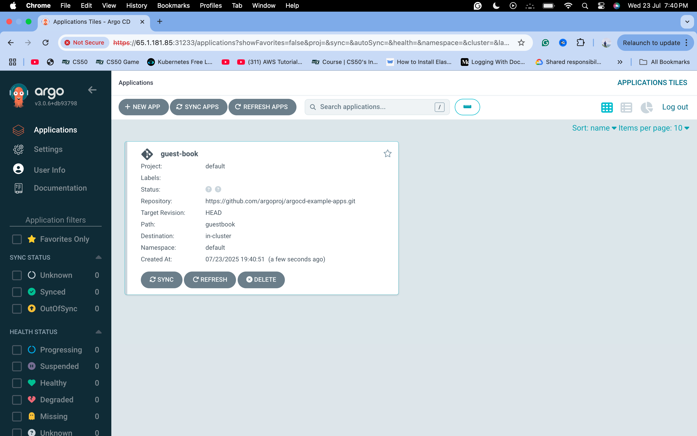

#### Step 4: Synchronize and Monitor

Activate deployment by clicking the **"SYNC"** button:

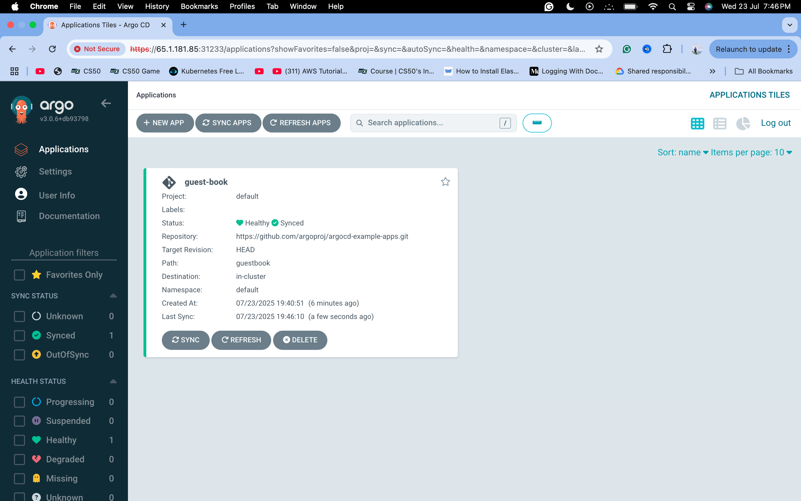

Explore the comprehensive application topology:

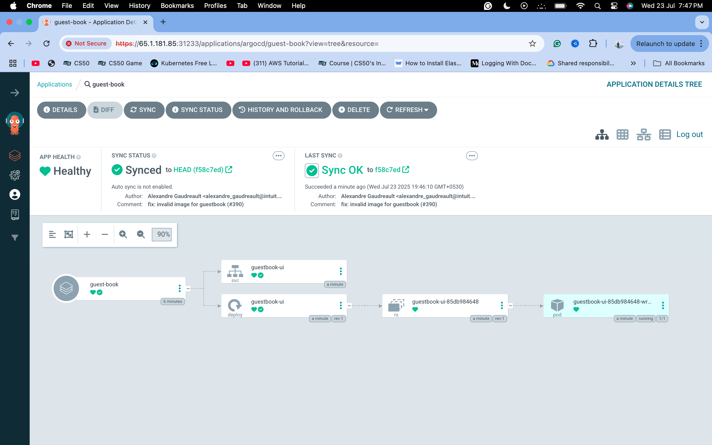

---

## 🔗 Connecting Git Repositories

Integrate your custom repositories for advanced GitOps workflows.

### Step 1: Access Repository Configuration

Navigate to **Settings → Repositories** in the ArgoCD interface:
- Click the gear icon ⚙️ in the sidebar
- Select **"Repositories"**
- Choose **"CONNECT REPO USING HTTPS"**

### Step 2: Repository Configuration

**For Public/HTTPS Repositories:**

| Field    | Example Value                                           | Notes                                     |
| -------- | ------------------------------------------------------- | ----------------------------------------- |
| Type     | `Git`                                                   | Repository type                           |
| Name     | `demo-app-argocd`                                       | Friendly name for identification          |
| Project  | `default`                                               | Project association                       |
| URL      | `https://github.com/harshitbisht22/demo-app-argocd.git` | Complete repository URL                   |
| Username | `your-github-username`                                  | Required for private repositories         |
| Password | `your-personal-access-token`                            | Use PAT for enhanced security             |

**For SSH Repositories:**

| Field           | Configuration                                           | Requirements                              |
| --------------- | ------------------------------------------------------- | ----------------------------------------- |
| Type            | `Git`                                                   | Repository type                           |
| URL             | `git@github.com:harshitbisht22/demo-app-argocd.git`     | SSH clone URL                             |
| SSH Private Key | `your-ssh-private-key-content`                          | Corresponding public key in GitHub        |

> 🔐 **Security Note:** For SSH access, ensure your public key is added to the repository's Deploy Keys section.

### Step 3: Validate Connection

Click **"Connect"** to establish and verify the repository link:

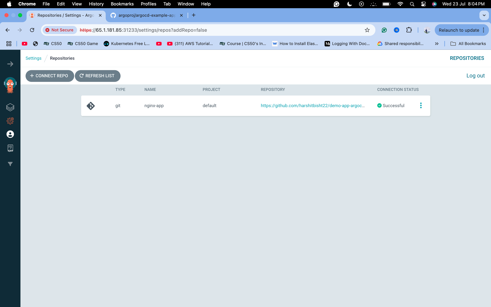

---

## 📁 Managing Applications

### Creating Custom Applications from Your Repository

Transform your custom manifests into managed ArgoCD applications.

#### Application Configuration

**Basic Settings:**

| Field             | Value                                       | Impact                                    |
|-------------------|---------------------------------------------|-------------------------------------------|
| Application Name  | `nginx-app`                                 | Descriptive application identifier        |
| Project           | `default`                                   | Organizational grouping                   |
| Sync Policy       | `Manual` or `Automatic`                     | Deployment automation level               |

**Source Specification:**

| Field           | Value                                                              | Function                                  |
|-----------------|--------------------------------------------------------------------|-------------------------------------------|
| Repository URL  | `https://github.com/harshitbisht22/demo-app-argocd.git`            | Your connected repository                 |
| Revision        | `HEAD`                                                             | Latest commit deployment                  |
| Path            | `manifests`                                                        | Manifest directory location               |

**Deployment Target:**

| Field           | Value                            | Purpose                                   |
|-----------------|----------------------------------|-------------------------------------------|
| Cluster         | `https://kubernetes.default.svc` | Target cluster endpoint                   |
| Namespace       | `nginx`                          | Isolated deployment namespace             |

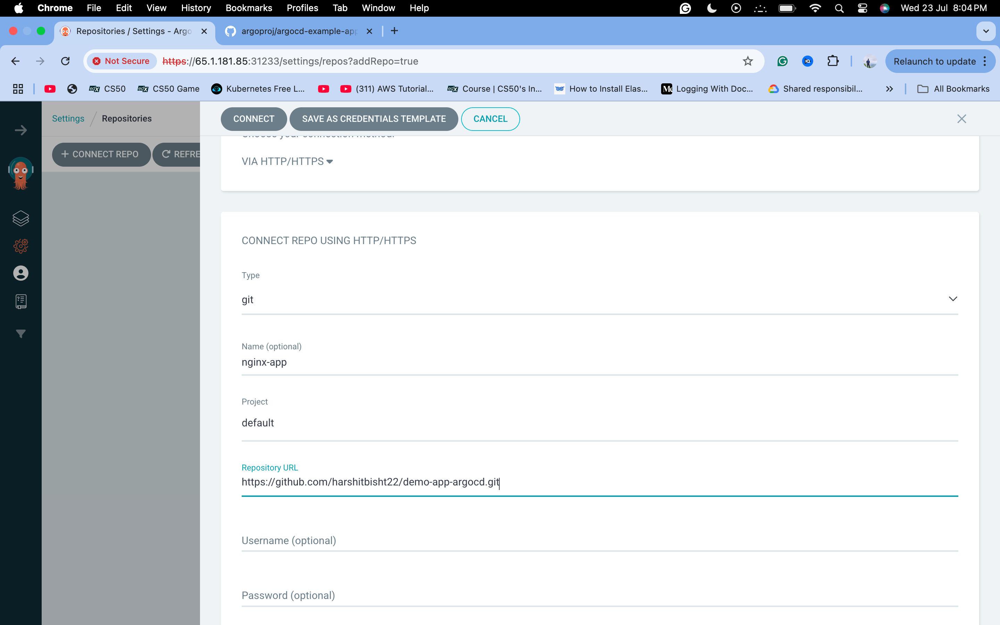

Visualize your application architecture:

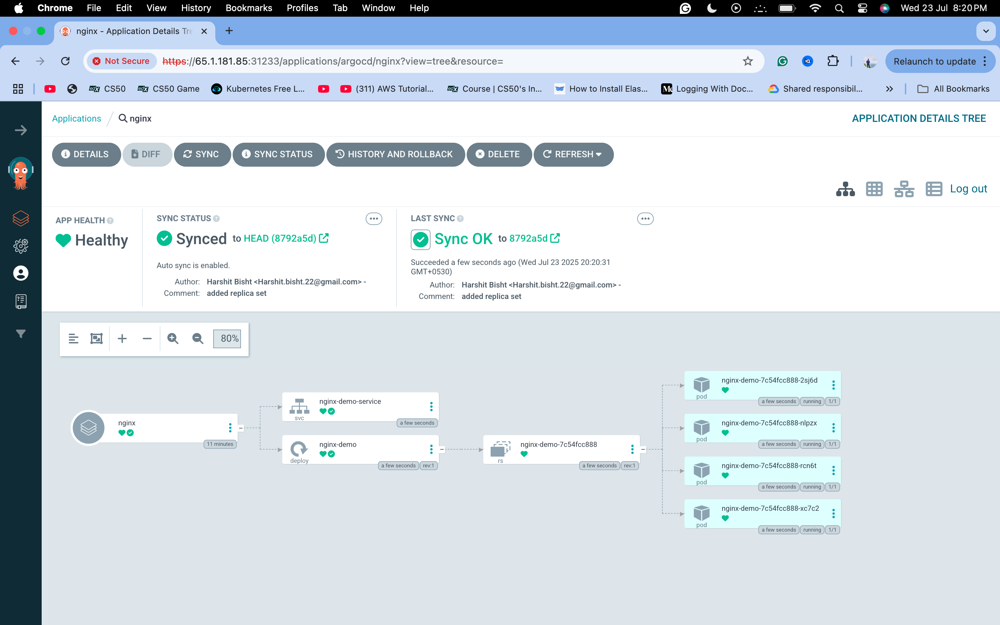

---

## 🔄 GitOps in Action: Automatic Synchronization

Experience the power of GitOps automation with real-time deployment updates.

### Demonstration: Live Configuration Updates

**Scenario:** Update deployment replicas from 4 to 30 instances

1. **Modify Repository**: Update your deployment manifest in GitHub
   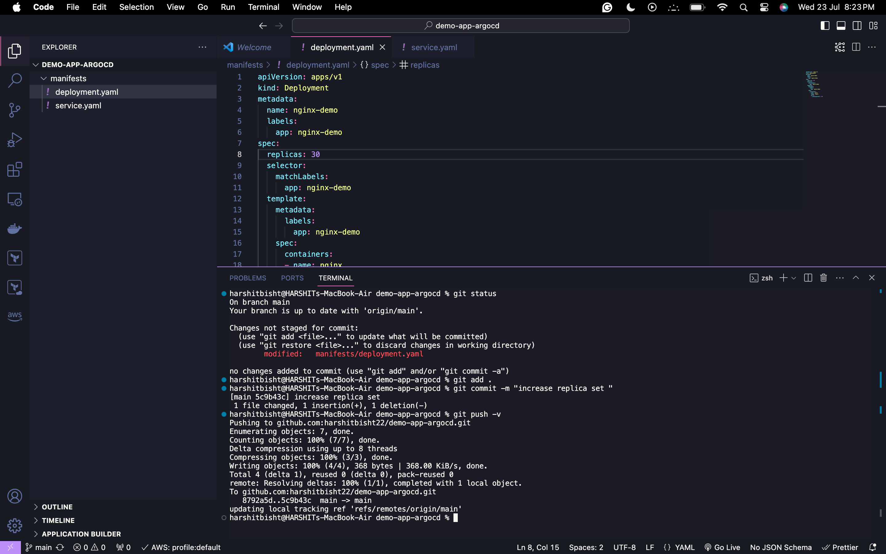

2. **Automatic Detection**: ArgoCD detects the configuration drift immediately

3. **Seamless Deployment**: With auto-sync enabled, changes deploy automatically
   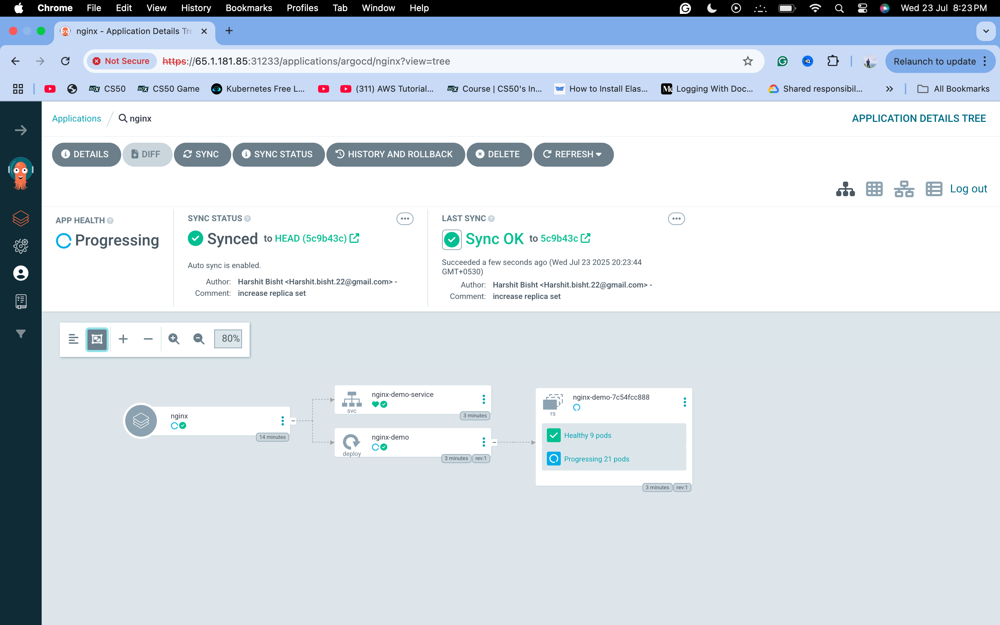

**Result:** Your application scales instantly, demonstrating the seamless integration between Git commits and Kubernetes deployments.

---

## 🛠️ Troubleshooting

### Common Issues and Solutions

**Application Sync Failures:**
- Verify repository connectivity and credentials
- Check manifest syntax and Kubernetes API compatibility
- Review namespace existence and RBAC permissions

**UI Access Problems:**
- Confirm NodePort service configuration
- Validate network connectivity and firewall rules
- Reset admin password if authentication fails

**Performance Optimization:**
- Configure resource limits for ArgoCD components
- Implement application projects for better organization
- Use sync windows for controlled deployment timing

---

## 🎯 Next Steps

**Enhance Your GitOps Journey:**
- Explore multi-cluster deployments
- Implement advanced sync policies and hooks
- Integrate with monitoring and alerting systems
- Establish governance with ArgoCD Projects and RBAC

**ArgoCD empowers your development team with:**
- ✅ Declarative application management
- ✅ Automated deployment workflows  
- ✅ Complete audit trails and rollback capabilities
- ✅ Multi-environment consistency

Transform your deployment strategy today with ArgoCD's powerful GitOps capabilities!


# 🚀 Ready to Transform Your Deployments?
- Start your GitOps journey today with ArgoCD!
- ⭐ Star this Repository • 🍴 Fork & Customize • 📝 Report Issues • 💬 Join Discussion

- Made with ❤️ by Harshit Bisht & the DevOps Community
- "Automate Everything, Deploy Confidently, Scale Effortlessly"
